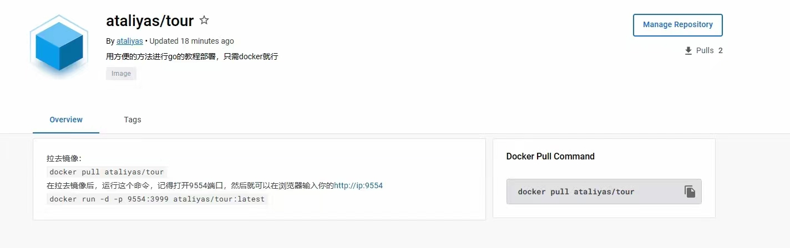

# go-study
大家如果想学golang，推荐官方的go tour教程，介于网站大多是go get下载，很麻烦，我集成了docker ，让安装离线文档变得轻松简单，只需拉去镜像和运行就可以了

<h2>我做了一个Docker直接拉镜像就能看到离线版的go开发文档，不需要go get下载</h2>

连接如下：

https://hub.docker.com/r/ataliyas/tour

用法：

拉去镜像：
 
docker pull ataliyas/tour
 
在拉去镜像后，运行这个命令，记得打开9554端口，然后就可以在浏览器输入你的http://ip:9554
 
docker run -d -p 9554:3999 ataliyas/tour:latest

已经搭建好的：
http://43.139.75.125:9554/

